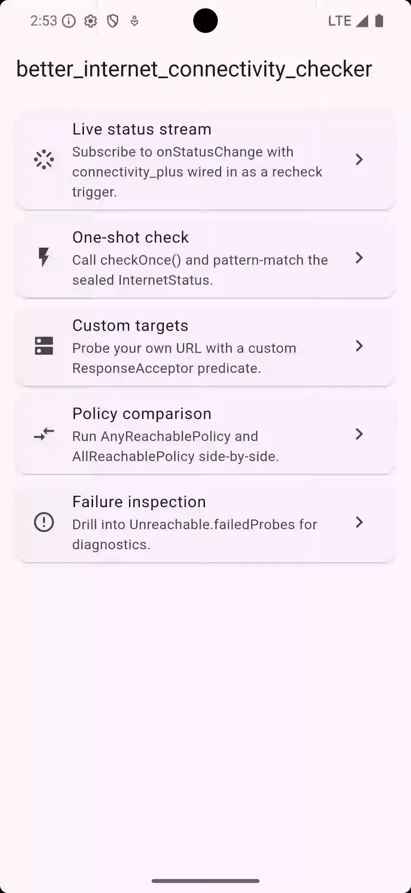
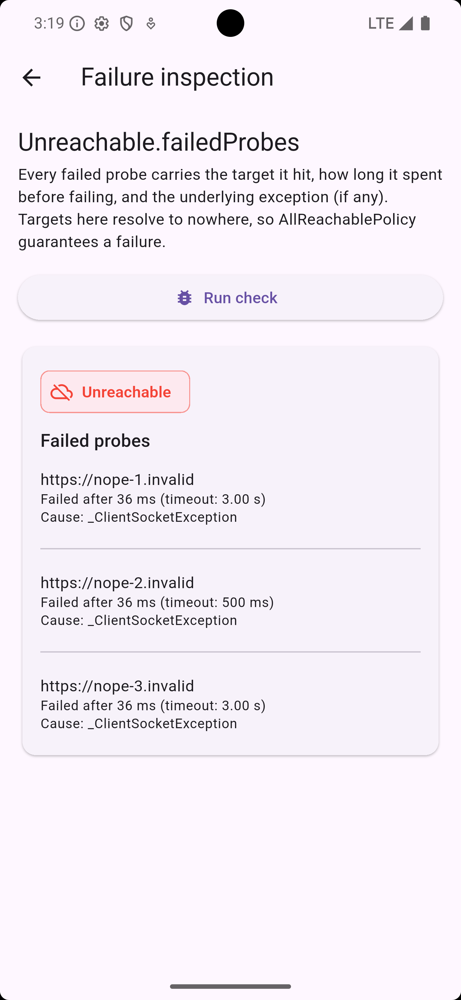

[](https://github.com/LahaLuhem/better_internet_connectivity_checker/actions/workflows/package.yml)
[](https://coveralls.io/github/LahaLuhem/better_internet_connectivity_checker?branch=main)
[](https://github.com/LahaLuhem/better_internet_connectivity_checker/pulls) [](https://pub.dev/packages/better_internet_connectivity_checker)
[](https://pub.dev/packages/better_internet_connectivity_checker)
[](https://pub.dev/packages/better_internet_connectivity_checker/score)
[](./LICENSE)
[](https://github.com/LahaLuhem/better_internet_connectivity_checker/issues) [](https://github.com/LahaLuhem/better_internet_connectivity_checker/issues?q=is%3Aissue+is%3Aclosed)
[](https://github.com/LahaLuhem/better_internet_connectivity_checker/pulls) [](https://github.com/LahaLuhem/better_internet_connectivity_checker/pulls?q=is%3Apr+is%3Aclosed)

<!-- TOC start (generated with https://github.com/derlin/bitdowntoc) -->

- [What it does](#what-it-does)
- [Installation](#installation)
- [Platform setup](#platform-setup)
    * [Android](#android)
    * [iOS and macOS](#ios-and-macos)
    * [Web](#web)
- [Usage](#usage)
    * [One-shot check](#one-shot-check)
    * [Pattern-matching the sealed status](#pattern-matching-the-sealed-status)
    * [Listening to status changes](#listening-to-status-changes)
    * [Slow-connection detection](#slow-connection-detection)
    * [Custom probe targets](#custom-probe-targets)
    * [Strict aggregation (every probe must succeed)](#strict-aggregation-every-probe-must-succeed)
    * [Controlling the check cadence](#controlling-the-check-cadence)
    * [Injecting a custom `http.Client`](#injecting-a-custom-httpclient)
    * [Falling back to GET](#falling-back-to-get)
    * [Writing a custom `ConnectivityProbe`](#writing-a-custom-connectivityprobe)
    * [Wiring `connectivity_plus` (Flutter)](#wiring-connectivity_plus-flutter)
    * [Wiring `retry` (reusing its backoff maths)](#wiring-retry-reusing-its-backoff-maths)
    * [Logging and observability](#logging-and-observability)
- [When to reach for this](#when-to-reach-for-this)
- [Performance & memory](#performance--memory)
    * [Benchmarks](#benchmarks)
- [Caveats](#caveats)
- [Roadmap](#roadmap)
- [Testing](#testing)
- [Contributing](#contributing)
    * [Optional: AI-agent discovery symlinks](#optional-ai-agent-discovery-symlinks)

<!-- TOC end -->

`better_internet_connectivity_checker` is a pure-Dart package for **internet reachability**
detection. It answers "can I actually reach the public internet right now?", which is a
different question from "is a network interface up?". That second one is what most
OS-reported connectivity signals, and most existing Dart and Flutter checkers, ultimately
rely on. This covers the gap where DNS resolves and the OS reports connected but HTTP
traffic is silently dropped: captive portals, transparent proxies, broken middleboxes,
LAN-only networks.

<p align="center">
  
</p>

## What it does

- Probes one or more URIs to determine *actual* internet reachability, not just "an
  interface is up". Catches the "DNS works but no internet" and "OS says connected but
  every request times out" failure modes that interface-level checks miss.
- Distinguishes **Reachable** from **Unreachable**, with an optional **good** or **slow**
  quality classification. Slow-connection detection is one response-time threshold, no
  extra plumbing.
- Streams status transitions on a broadcast stream, de-duped so the same status kind is
  not re-emitted on every periodic tick.
- Ships a default HTTP-HEAD probe with a GET fallback (`HttpProbe.head()` /
  `HttpProbe.get()`) for endpoints that reject HEAD. The probe layer is pluggable, so
  retry decorators, alternative transports, or test stubs slot in without touching the
  rest of the package.
- Ships **any-of-N** (default) and **all-of-N** (strict) aggregation policies. The policy
  layer is pluggable too.
- Checks at a fixed interval by default, or backs off while the connection stays down
  (`ExponentialBackoffSchedule`). The cadence layer is pluggable too, so an app can supply
  its own `CheckSchedule`.
- Exposes an `externalRecheckTrigger` hook so callers can plug in OS-level network-change
  signals (`connectivity_plus` on Flutter is the canonical wiring) without the package
  itself taking a Flutter dependency.
- Pure Dart, so it works on CLI, server, web, and Flutter with no platform channels.

## Installation

```bash
dart pub add better_internet_connectivity_checker
```

Requires Dart 3.13 or newer. Pure Dart, so it works the same in a Flutter app, a CLI, a
server, or on the web.

## Platform setup

The package is pure Dart, but the underlying OS still gates outbound network access. The
defaults probe over HTTPS only. HTTP-only probes you wire in have extra caveats on iOS
and macOS.

Pure-Dart CLI and server-side targets need no setup. Flutter targets do:

### Android

Add `android.permission.INTERNET` to `android/app/src/main/AndroidManifest.xml`:

```xml
<manifest xmlns:android="http://schemas.android.com/apk/res/android">
    <uses-permission android:name="android.permission.INTERNET"/>
    <!-- ... -->
</manifest>
```

Flutter scaffolds this permission into the **debug** and **profile** manifest variants
(so the tooling can attach for hot reload) but **not** into `main`, the only variant
included in release builds. Without the declaration above, every probe fails immediately
with `_ClientSocketException` in single-digit milliseconds. That is the OS denying the
socket rather than a real timeout, so `flutter run --release` reports unreachable while
`flutter run` works.

### iOS and macOS

HTTPS probes work out of the box. HTTP-only probes need an App Transport Security
exception in `ios/Runner/Info.plist` (and the macOS equivalent). Sandboxed macOS apps
additionally need the `com.apple.security.network.client` entitlement in
`macos/Runner/*.entitlements`.

### Web

Probe targets must serve `Access-Control-Allow-Origin` matching your app's origin. See
[Caveats](#caveats).

## Usage

### One-shot check

```dart
import 'package:better_internet_connectivity_checker/better_internet_connectivity_checker.dart';

Future<void> main() async {
    final checker = InternetConnection();
    final status = await checker.checkOnce();
    print(status is Reachable ? 'online' : 'offline');
    await checker.dispose();
}
```

`checkOnce()` is standalone: it does not touch the periodic timer, the status stream,
`lastStatus`, or the failure streak a `CheckSchedule` sees. Call it as often as you like
without disturbing a running checker.

### Pattern-matching the sealed status

`InternetStatus` is a sealed class. Exhaustive `switch` is the recommended way to consume
it, and the compiler will tell you if a future variant is added.

`Reachable` carries the winning probe's `responseTime` and a `quality` of `good` or `slow`.
`Unreachable` carries every `ProbeResult` that failed, each with its `target`, `responseTime`,
and the `error` caught (null when the target's own predicate rejected an otherwise-fine
response). That is enough to answer "why am I offline" without probing again:

```dart
switch (await checker.checkOnce()) {
  case Reachable(:final responseTime, :final quality):
    print('online — $quality, ${responseTime.inMilliseconds} ms');
  case Unreachable(:final failedProbes):
    for (final probeResult in failedProbes) {
      print(
        '${probeResult.target.uri.host} failed after '
        '${probeResult.responseTime.inMilliseconds} ms: '
        '${probeResult.error ?? 'response rejected'}',
      );
    }
}
```

<p align="center">
  
</p>

### Listening to status changes

```dart
final checker = InternetConnection();
final subscription = checker.onStatusChange.listen((status) {
    // Same status kind is not re-emitted, so this fires only on real transitions.
});

// later:
await subscription.cancel();
await checker.dispose();
```

### Slow-connection detection

Pass a `slowThreshold` to classify the `quality` field on every `Reachable` status:

```dart
final checker = InternetConnection(slowThreshold: const Duration(milliseconds: 500));
```

### Custom probe targets

Override the default reliability endpoints, e.g. to probe your own healthchecks:

```dart
final checker = InternetConnection(
    targets: [
        ProbeTarget(uri: Uri.parse('https://my-api.example.com/health')),
        ProbeTarget(
            uri: Uri.parse('https://other.example.com/ping'),
            isSuccess: (response) => response.statusCode == 204,
        ),
    ],
);
```

### Strict aggregation (every probe must succeed)

```dart
final checker = InternetConnection(policy: const AllReachablePolicy());
```

Recommended only with a curated probe list. Under the default endpoint set, any one public
endpoint being down would flag a working connection as unreachable.

### Controlling the check cadence

Every check is `checkInterval` apart by default, pass or fail. `ExponentialBackoffSchedule`
widens the gap while checks keep failing, and snaps back the moment one succeeds:

```dart
final checker = InternetConnection(
  checkInterval: const Duration(seconds: 10),
  schedule: const ExponentialBackoffSchedule(maxDelay: Duration(minutes: 5)),
);
```

`checkInterval` is the base the ladder grows from. The first failure retries at the base and
growth starts from the second, so the above runs nominally 10s, 10s, 20s, 40s, 80s, and on to
the 5-minute cap. Any `Reachable` result resets it, and so does an `externalRecheckTrigger` event.

Each delay is spread ±25 % by default (`randomizationFactor`), so a fleet that dropped together
does not return in lockstep. `maxDelay` stays a hard ceiling and the floor moves with the factor,
so nothing polls faster than `checkInterval * (1 - randomizationFactor)`. Set `0` for exact delays.

`NextCheckScheduledEvent` on [`events`](#logging-and-observability) reports the delay the
schedule picked plus the failure streak behind it, which is the quickest way to see why a
checker has gone quiet.

Supply your own cadence by implementing `CheckSchedule`. If you already model backoff with
[`retry`](https://pub.dev/packages/retry) elsewhere, see
[Wiring `retry`](#wiring-retry-reusing-its-backoff-maths).

### Injecting a custom `http.Client`

For proxies, middleware, or a `MockClient` in tests:

```dart
import 'package:http/http.dart' as http;

final checker = InternetConnection(probe: HttpProbe.head(client: myHttpClient));
```

### Falling back to GET

Some endpoints reject HEAD (HTTP 405) or strip caching headers on it. Swap to
`HttpProbe.get()` per-instance:

```dart
final checker = InternetConnection(probe: HttpProbe.get());
```

The GET probe drains the response body from the wire but does not buffer it into
memory, so a verbose endpoint does not bloat the probe's footprint. Any custom
`isSuccess` predicate sees an empty `response.body` regardless of what the server
returned, so inspect `statusCode` and `headers` instead.

### Writing a custom `ConnectivityProbe`

For probes that go beyond HTTP (DNS, TCP, a private API, or a wrapper around another
probe), implement `ConnectivityProbe.probe(target, {cancelSignal})`. You do not have to
watch `target.timeout`: `InternetConnection` caps every probe at it and reports a
`TimeoutException` failure when it runs out. The cap covers the whole call, so a probe that
retries internally has to fit its attempts inside that budget.

Do honour the optional `cancelSignal` whenever your transport can cancel. It fires when a
sibling probe already settled the answer under `AnyReachablePolicy`, or when the deadline
runs out, so the in-flight request can drop its socket instead of holding it. The built-in
`HttpProbe` wires it to `http.AbortableRequest`. Probes that cannot abort just ignore the
parameter, and the policy still resolves correctly.

`ProbeResult` deliberately carries no protocol-specific data. When a probe needs to surface
some (an HTTP `Allow` header, say), expose it on the probe itself via a constructor callback:
[`method_aware_probe.dart`](example/lib/features/custom_targets/method_aware_probe.dart) is the
worked example.

### Wiring `connectivity_plus` (Flutter)

The package does not depend on `connectivity_plus`. It accepts any `Stream<void>` as an
external trigger, so Flutter apps can wire it up themselves:

```dart
import 'package:connectivity_plus/connectivity_plus.dart';

final checker = InternetConnection(
    externalRecheckTrigger:
    Connectivity().onConnectivityChanged.map(noopWithVal),
);
```

### Wiring `retry` (reusing its backoff maths)

The package does not depend on [`retry`](https://pub.dev/packages/retry). The built-in
`ExponentialBackoffSchedule` covers the same ground with no extra dependency. Reach for this only
when an app already expresses its backoff policy as a `RetryOptions` and wants one source of truth:

```dart
import 'package:retry/retry.dart';

final class RetryOptionsSchedule implements CheckSchedule {
  final Duration maxDelay;

  const RetryOptionsSchedule({required this.maxDelay});

  @override
  Duration nextDelay(ScheduleContext scheduleContext) {
    // `delay(0)` is `Duration.zero`, which would spin the scheduler.
    if (scheduleContext.consecutiveFailures == 0) return scheduleContext.baseInterval;

    // Rebuilt per call: `delayFactor` is fixed at construction, so a `RetryOptions` held as a
    // field would ignore a `checkInterval` reassigned at runtime. Half the base makes
    // `delay(streak)` match this package's ladder.
    final options = RetryOptions(
      delayFactor: scheduleContext.baseInterval ~/ 2,
      maxDelay: maxDelay,
    );

    return options.delay(scheduleContext.consecutiveFailures);
  }
}
```

`RetryOptions` brings its own ±25 % jitter, but has no multiplier knob (growth is hardcoded at
`2^n`), and its `maxAttempts` / `retry()` go unused since a monitor never stops polling.

### Logging and observability

`InternetConnection.events` is a `Stream<ConnectivityEvent>` that fans out every
lifecycle moment (check completions, status emissions, external triggers, configuration
changes, dispose) as typed, pattern-matchable values. Subscribe directly for
reactive pipelines, or adapt a `ConnectivityObserver` onto it via the top-level
`attachObserver` for the classic per-method-callback style.

`PrintingConnectivityObserver` is a ready-to-use default that forwards each event through
`dart:developer`'s `log()`. That integrates with Flutter DevTools' logging view, and in plain
Dart it surfaces via stdout:

```dart
final checker = InternetConnection();
final subscription = attachObserver(
  checker.events,
  const PrintingConnectivityObserver(),
);
// ... later, when shutting down:
await subscription.cancel();          // explicit cleanup, OR
await checker.dispose();              // closes events; the subscription cancels automatically
```

For reactive callers that prefer streams over per-method callbacks, subscribe directly and
pattern-match:

```dart
checker.events.listen((event) {
  if (event case CheckCompletedEvent(:final result)) log('check completed: $result');
});
```

For custom integration with an app's existing logging service, subclass
`ConnectivityObserver` and override only the events that matter, then wire it with
`attachObserver`:

```dart
final class _AppConnectivityObserver extends ConnectivityObserver {
  const _AppConnectivityObserver(this._logger);
  final AppLogger _logger;

  @override
  void onStatusChangeEmitted(InternetStatus? previous, InternetStatus next) =>
      _logger.info('connectivity: ${previous ?? '<none>'} -> $next');

  @override
  void onExternalTriggerError(Object error, StackTrace stackTrace) =>
      _logger.error('connectivity trigger failed', error, stackTrace);
}

attachObserver(checker.events, _AppConnectivityObserver(appLogger));
```

Keep overrides fast. Dispatch is microtask-deferred, so a throw inside one cannot disturb
the scheduler, but a Dart isolate is single-threaded and blocking work in an override still
stalls every timer on it. Debug builds time each callback and warn once per event type when
one overruns 16 ms. Release and profile builds strip the watchdog. Full threading notes are
on `ConnectivityObserver`'s dartdoc.

Runnable examples live in [`example/`](./example/), a Flutter demo app exercising one-shot
checks, status streaming, both aggregation policies, slow-connection detection, and a custom
probe.

## When to reach for this

The Dart / Flutter ecosystem already has reachability and connectivity packages. They
each answer a slightly different question, and the right pick depends on the question
*you* are trying to answer.

**Reach for this package when** your problem looks like one of these:

- The OS reports a Wi-Fi or cellular connection, but the app times out on every request.
- A captive portal (hotel, airport, conference Wi-Fi) is intercepting traffic, and your
  app needs to know it's not really online.
- You need to distinguish "slow but reachable" from "offline", for a slow-connection UI
  banner, a quality-aware retry policy, or analytics on degraded connections.
- You need diagnostic output on a failed check. *Which* probe failed, *what* error, *how
  long* it took, not a bare `false`.
- You're on a non-Flutter Dart target (CLI, server, web) and need internet-reachability
  detection without a Flutter plugin in the dep tree.

**Compared to the other established choices:**

- [`connectivity_plus`](https://pub.dev/packages/connectivity_plus) answers a *different*
  question: "what network type is the OS on (Wi-Fi / cellular / none)?". It does not
  probe actual reachability, so a captive portal registers as a healthy Wi-Fi connection.
  The two packages are complementary: wire `connectivity_plus` as this package's
  `externalRecheckTrigger` to get instant rechecks on OS network-state flips (canonical
  wiring in [Usage](#wiring-connectivity_plus-flutter)).
- [`internet_connection_checker`](https://pub.dev/packages/internet_connection_checker)
  and
  [`internet_connection_checker_plus`](https://pub.dev/packages/internet_connection_checker_plus)
  answer the *same* question this package does. They're battle-tested and a fine default
  if you don't need slow-connection classification (missing from the `_plus` fork, see
  [issue #71](https://github.com/OutdatedGuy/internet_connection_checker_plus/issues/71)),
  pluggable aggregation policies, or per-probe failure diagnostics. This package layers a
  probe, policy and schedule architecture under the same headline feature set. Worth the
  extra surface area if you need the seams, overkill if you don't.

**Don't reach for this if** you only need "what network type am I on?". Use
`connectivity_plus` directly and skip the per-check probe cost.

## Performance & memory

What the default configuration buys you, with no further configuration:

- **Race-and-cancel probes.** `AnyReachablePolicy` returns on the first success and aborts
  in-flight siblings at the transport layer, so sockets release immediately rather than at
  timeout-drain. See
  [`APPENDIX.md`](./APPENDIX.md#probe-cancellation-via-http-abortable).
- **Bounded checks.** Every probe is capped at its target's timeout no matter what the
  transport does, so one dead endpoint cannot stretch the gap between checks. See
  [`APPENDIX.md`](./APPENDIX.md#why-the-coordinator-keeps-the-deadline).
- **Shared `http.Client`.** Connection pooling and TLS-session reuse across periodic ticks,
  instead of a fresh socket per probe.
- **HTTP HEAD, not GET.** No response body on the wire. See
  [`APPENDIX.md`](./APPENDIX.md#why-http-head-default-probe)
  for why HEAD over a cheaper DNS / TCP probe.
- **Listener-gated periodic timer.** Auto-suspends when nothing is listening to
  `onStatusChange`, auto-resumes on first re-subscription. No CPU or network spend while
  the stream has no consumers.
- **Status-kind de-duping.** Two consecutive `Reachable(quality: good)` events do not
  re-emit, so downstream `setState` and listener rebuilds fire only on real transitions.
  Quality flips and reachability flips do re-emit.
- **`const` defaults and `ConstUri` lazy parsing.** The default target list and its URIs are
  compile-time constants shared process-wide, so `InternetConnection()` with no `targets`
  argument allocates nothing for the target list.
- **Nothing accumulates.** An `Unreachable`'s `failedProbes` is bounded by the target count,
  and no status history, rolling window, or per-probe cache is kept anywhere.

Memory footprint per `InternetConnection` is well under 1 KB at steady state.

### Benchmarks

Empirical backing for the perf claims above lives in
[`benchmark/`](https://github.com/LahaLuhem/better_internet_connectivity_checker/tree/main/benchmark)
, a reproducible harness of AOT-compiled scenarios and micro-benches, orchestrated by a
Python runner that aggregates with Mann-Whitney U significance tests. The committed snapshot is in
[`benchmark/reports/SUMMARY.md`](https://github.com/LahaLuhem/better_internet_connectivity_checker/blob/main/benchmark/reports/SUMMARY.md).
Methodology and reproduction steps are in
[`benchmark/README.md`](https://github.com/LahaLuhem/better_internet_connectivity_checker/blob/main/benchmark/README.md).

Numbers and charts below are the maintainer's machine snapshot (Apple Silicon macOS,
Dart SDK 3.13.0, N=30). They are sanity-check ballparks, not a performance contract. CPU,
GC, OS scheduler, and thermal state vary across machines, so your absolute numbers WILL
differ. Capture your own local baseline before claiming a regression
or an improvement from a code change.


## Caveats

Deliberate non-features that may affect how you use the package:

- **Concurrent `checkOnce()` calls are not coalesced.** Each spins a full probe fan-out,
  with no built-in single-flight. If your app issues many simultaneous reachability
  checks, wrap your own debouncer or share one `Future`. Rationale in
  [`APPENDIX.md`](./APPENDIX.md#why-no-checkonce-coalescing).
- **`Unreachable.failedProbes` retains caught `Exception` objects** on each
  `ProbeResult.error`. If those exceptions chain heavy transport state (TLS context,
  request bodies, custom error payloads), an `Unreachable` reference can keep that memory
  alive. Drop the reference once you're done, or extract only what you need from it.
- **HTTP caching on probe endpoints will mask outages.** Use endpoints that respond with
  `Cache-Control: no-cache`. Two of the current defaults do not: `pokeapi.co` sends
  `max-age=86400` and `jsonplaceholder` sends `max-age=43200`. On the web platform, probe
  targets must also allow CORS for the request to reach the probe.
- **Backing off delays recovery, by design.** While `ExponentialBackoffSchedule` is waiting,
  a connection that comes back is not noticed until the next check, so an aggressive `maxDelay`
  can leave an app believing it is offline for minutes. Pair backoff with an
  `externalRecheckTrigger` and keep `maxDelay` inside the staleness you can tolerate. The
  default schedule has no such gap. The `backoff_recovery` benchmark puts numbers on the
  trade: median 55.6 % fewer probes during an outage, for recovery noticed in ~1.3 s
  instead of ~0.3 s.
- **Captive-portal detection is a side effect of HTTPS, and it has holes.** A portal
  answering in place of a default target holds no valid certificate for it, so the handshake
  fails and the check reports `Unreachable`, which is the right answer. Two things that does
  not cover: a portal whitelisting one target before login, where any-of-N reports
  `Reachable` off that single host, and plain-HTTP targets you configure yourself, where a
  portal's `200` login page and a `302` to it both pass the default predicate with nothing in
  the response to give them away. The package also never says "portal", only `Unreachable`.
  You can usually tell the cases apart from the errors on `Unreachable.failedProbes`: every
  probe failing with a handshake error points at interception, every one timing out points at
  dropped packets. Mechanism and measurements in
  [`APPENDIX.md`](./APPENDIX.md#what-portal-detection-rests-on).
- **`AllReachablePolicy` is brittle with arbitrary public endpoints.** Any one being briefly
  unavailable flags a working connection as offline. Use it only with a curated probe list,
  such as enterprise internal endpoints. See the policy's dartdoc.

## Roadmap

Features deferred today but inside the design envelope (no API break required to add):

- **Single-flight `checkOnce()` coalescing.** Share one in-flight `Future` across
  concurrent callers. Will land if real-world demand surfaces. See
  [`APPENDIX.md`](./APPENDIX.md#why-no-checkonce-coalescing).
- **Optional status-history buffer for diagnostics.** A rolling window of recent
  transitions, opt-in with a buffer-size knob. This is the one genuine
  memory-versus-observability trade-off in the package. Until it lands, no history is kept.
- **DNS and TCP probes as custom `ConnectivityProbe` implementations.** Faster, but they
  lose captive-portal, TLS and transparent-proxy detection. Out of scope as defaults, fine
  as user-supplied probes against the existing `ConnectivityProbe` seam. See
  [`APPENDIX.md`](./APPENDIX.md#why-http-head-default-probe).

Not on the roadmap (deliberate non-features):

- **No performance-preset enum or perf-versus-memory slider.** The orthogonal knobs
  (`checkInterval`, `targets`, `policy`, `probe`, `schedule`) already control the real
  trade-offs, and collapsing them onto one slider loses information. Rationale in
  [`APPENDIX.md`](./APPENDIX.md#why-no-perf-preset).

## Testing

```bash
dart test                                            # full test suite
dart analyze --fatal-infos                           # strict-mode static analysis
dart format --output=none --set-exit-if-changed .    # formatter check
```

Dart 3.13+ required (see `pubspec.yaml`).

## Contributing

Issues and PRs welcome at
<https://github.com/LahaLuhem/better_internet_connectivity_checker>. Before sending a
non-trivial change, read [`CODESTYLE.md`](./CODESTYLE.md) for the house style,
[`.ai/AGENTS.md`](./.ai/AGENTS.md) for the hard rules and contributor / AI-agent
guidelines, and [`APPENDIX.md`](./APPENDIX.md) for the design rationale.

### Optional: AI-agent discovery symlinks

Canonical agent guidance lives under `.ai/`. The repo root holds gitignored symlinks so
agents that auto-discover root-level files find them without two extra Markdown files at
each level. Opt-in, and nothing in the build, lint, or test pipeline depends on them:

```bash
ln -s .ai/AGENTS.md AGENTS.md
ln -s .ai/CLAUDE.md CLAUDE.md
ln -s .ai/AGENTS.md example/AGENTS.md
ln -s .ai/AGENTS.md benchmark/python/AGENTS.md
```

Drop a real `AGENTS.md` at the root instead if you want your own. Rationale in
[`APPENDIX.md`](./APPENDIX.md#ai-files-symlinked).
