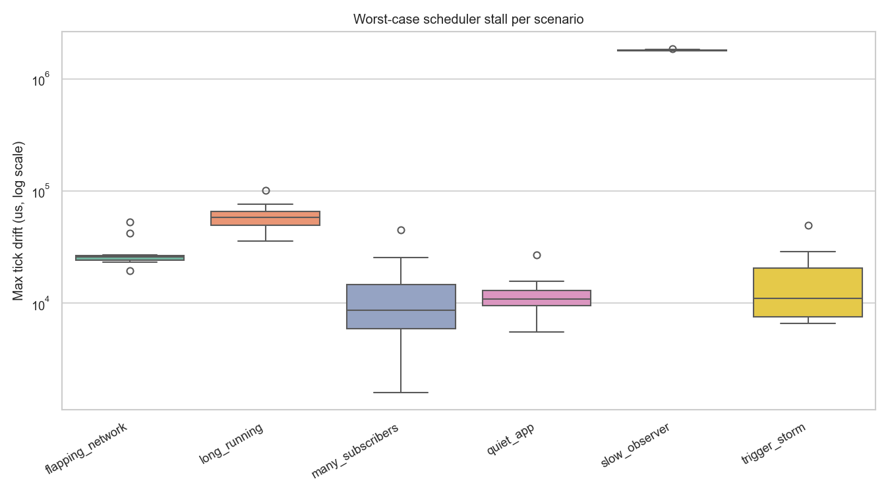
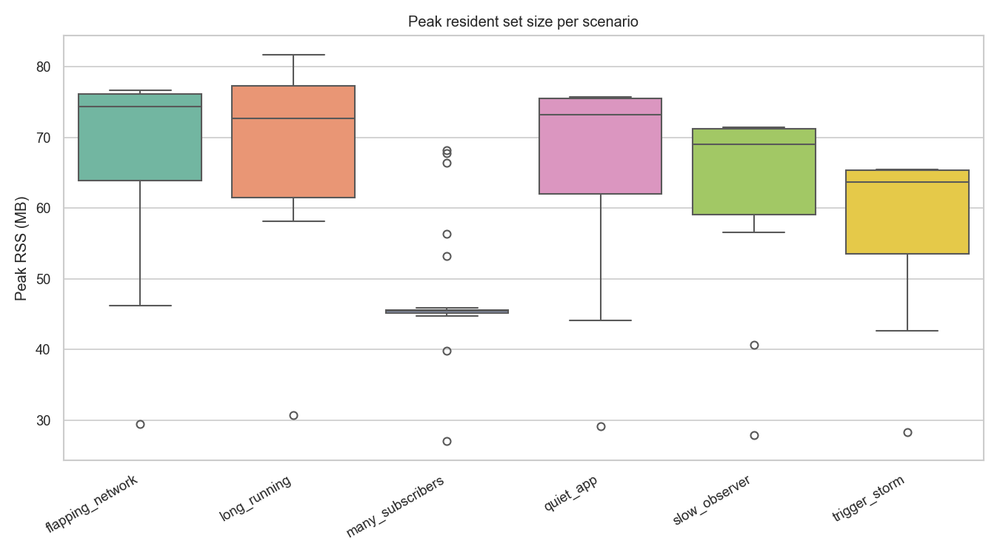
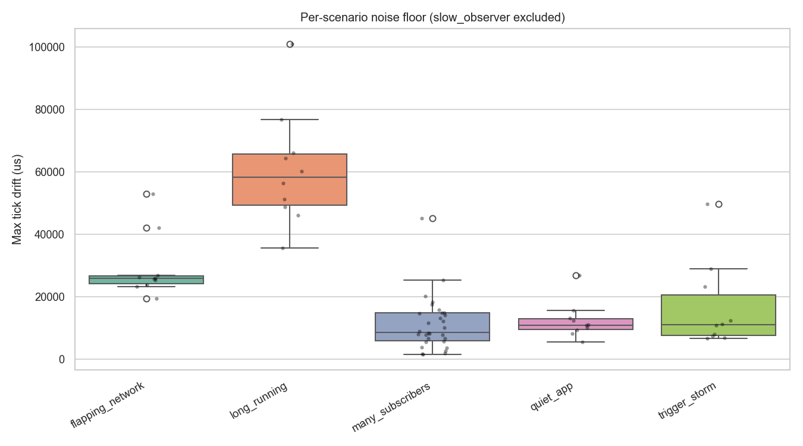
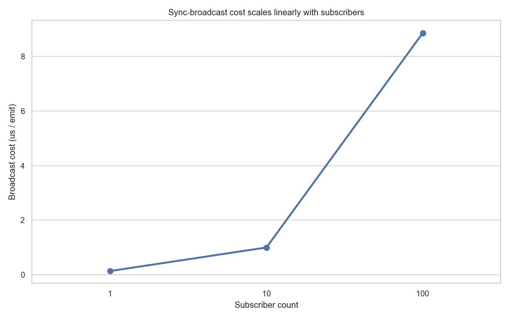

# Benchmark results

Captured **2026-05-22** against `0.2.0` at `e141638` on Dart SDK 3.11.5. N=10 iterations per scenario.

> Per-machine measurements. Numbers below reflect *this* machine (CPU, GC, OS scheduler, thermal state). Your numbers WILL differ - capture your own local baseline before measuring a code delta.

## Headline: worst-case scheduler stall per scenario

The `slow_observer` scenario simulates a heavy synchronous observer (50 ms per callback) running against a 100 ms tick. Pre-refactor, this blocks the scheduler - the box for `slow_observer` should tower over the others on the log axis below.

| Scenario | N | Median (us) | IQR (us) | Min (us) | Max (us) |
|---|---:|---:|---:|---:|---:|
| `flapping_network` | 10 | 25,881 | 3,183 | 19,388 | 52,931 |
| `long_running` | 10 | 58,196 | 17,330 | 35,601 | 100,865 |
| `many_subscribers` | 30 | 8,634 | 9,107 | 1,610 | 45,099 |
| `quiet_app` | 10 | 10,897 | 3,811 | 5,582 | 26,822 |
| `slow_observer` | 10 | 1,787,673 | 16,767 | 1,777,024 | 1,840,575 |
| `trigger_storm` | 10 | 11,020 | 15,721 | 6,635 | 49,729 |

## Peak resident set size per scenario

Peak RSS captured via `ProcessInfo.currentRss` sampled every 500 ms (every 250 ms in `long_running`). The package's memory footprint baseline; future refactors should not regress this without reason.

| Scenario | N | Median (MB) | IQR (MB) | Min (MB) | Max (MB) |
|---|---:|---:|---:|---:|---:|
| `flapping_network` | 10 | 74.30 | 15.12 | 29.45 | 76.61 |
| `long_running` | 10 | 72.62 | 17.88 | 30.67 | 81.62 |
| `many_subscribers` | 30 | 45.45 | 0.41 | 27.09 | 68.20 |
| `quiet_app` | 10 | 73.14 | 16.36 | 29.14 | 75.67 |
| `slow_observer` | 10 | 68.98 | 14.86 | 27.86 | 71.45 |
| `trigger_storm` | 10 | 63.66 | 14.67 | 28.34 | 65.44 |

## Stability: noise floor across scenarios (slow_observer excluded)

Same metric as the headline chart, but with the `slow_observer` outlier excluded so the y-scale is readable. A narrow box = the metric is reproducible iteration-to-iteration.

| Scenario | N | Median (us) | IQR (us) | Min (us) | Max (us) |
|---|---:|---:|---:|---:|---:|
| `flapping_network` | 10 | 25,881 | 3,183 | 19,388 | 52,931 |
| `long_running` | 10 | 58,196 | 17,330 | 35,601 | 100,865 |
| `many_subscribers` | 30 | 8,634 | 9,107 | 1,610 | 45,099 |
| `quiet_app` | 10 | 10,897 | 3,811 | 5,582 | 26,822 |
| `trigger_storm` | 10 | 11,020 | 15,721 | 6,635 | 49,729 |

## Subscriber scaling: broadcast cost vs N listeners

From the `status_emission` micro (synchronous broadcast, isolated from the rest of the package). Production `InternetConnection` uses async-default broadcast where the producer pays a constant cost regardless of N; this chart isolates the per-listener *delivery* cost.

| Subscribers | N | Median (us/emit) | IQR (us) |
|---:|---:|---:|---:|
| 1 | 10 | 0.132 | 0.002 |
| 10 | 10 | 0.996 | 0.014 |
| 100 | 10 | 8.81 | 0.095 |

