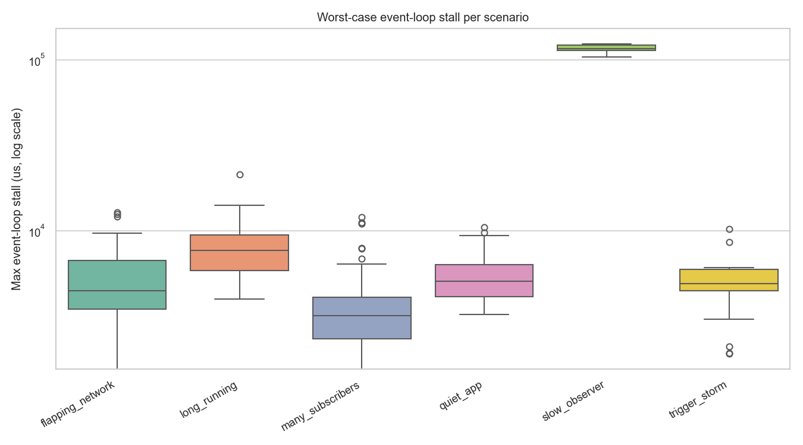
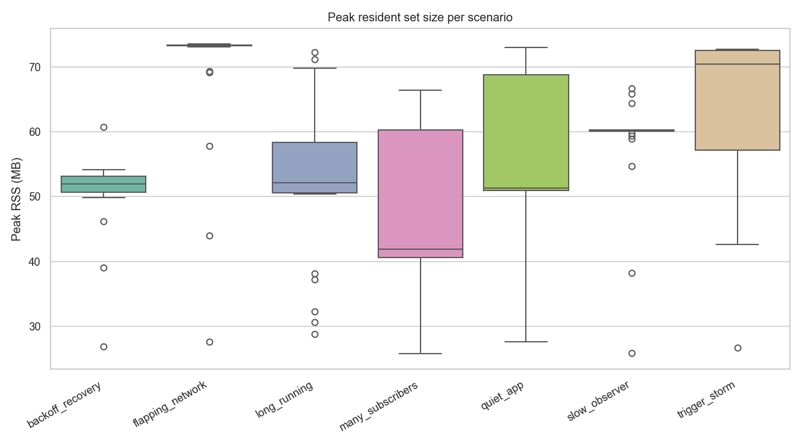
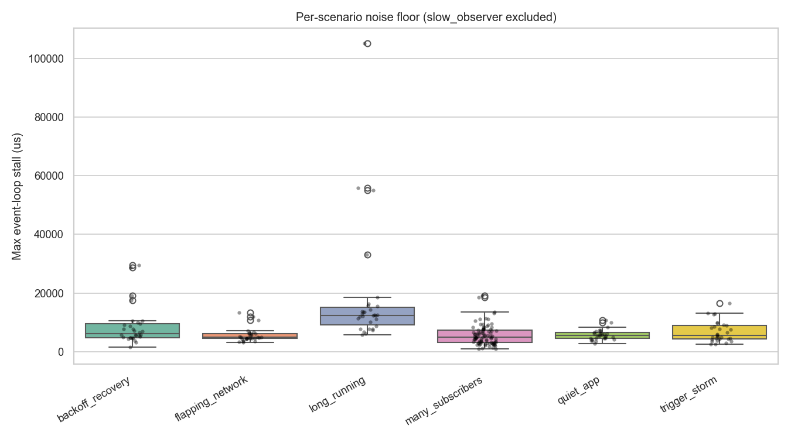
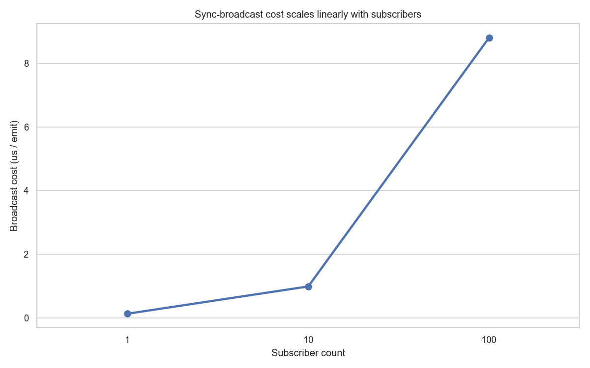

# Benchmark results

Captured **2026-07-24** against `0.2.0` at `b27e6b9` on Dart SDK 3.12.2. N=30 iterations per scenario.

> Per-machine measurements. Numbers below reflect *this* machine (CPU, GC, OS scheduler, thermal state). Your numbers WILL differ - capture your own local baseline before measuring a code delta.

## Headline: worst-case event-loop stall per scenario

Longest single continuous window in which synchronous work blocked the event loop (gap between 1 ms heartbeats, minus the heartbeat interval). The `slow_observer` scenario wires a deliberately-misbehaving observer that sleeps 50 ms per callback, so its box should sit at ~50k us - the observer's own blocking time, which no dispatch strategy can mask on a single-threaded isolate. The other scenarios show the package's intrinsic noise floor.

| Scenario | N | Median (us) | IQR (us) | Min (us) | Max (us) |
|---|---:|---:|---:|---:|---:|
| `flapping_network` | 30 | 4,453 | 3,374 | 0.000 | 12,808 |
| `long_running` | 30 | 7,708 | 3,669 | 3,992 | 21,360 |
| `many_subscribers` | 90 | 3,203 | 1,783 | 0.000 | 12,070 |
| `quiet_app` | 30 | 5,066 | 2,403 | 3,242 | 10,537 |
| `slow_observer` | 30 | 116,174 | 8,922 | 104,072 | 123,874 |
| `trigger_storm` | 30 | 4,897 | 1,518 | 1,919 | 10,280 |

## Event-loop blocked share per scenario

`blocked_duty_ratio` is total stalled time divided by the measured window - the duration-independent 'how bad is it overall' number. For `slow_observer` expect roughly delay / check-interval (~50%); everything else should be near zero.

| Scenario | N | Median (%) | IQR (%) | Min (%) | Max (%) |
|---|---:|---:|---:|---:|---:|
| `flapping_network` | 30 | 0.37% | 0.58% | 0.00% | 1.79% |
| `long_running` | 30 | 0.55% | 0.40% | 0.06% | 1.49% |
| `many_subscribers` | 90 | 0.59% | 0.76% | 0.00% | 1.83% |
| `quiet_app` | 30 | 0.49% | 0.57% | 0.07% | 1.60% |
| `slow_observer` | 30 | 57.38% | 0.78% | 56.47% | 58.47% |
| `trigger_storm` | 30 | 0.38% | 0.69% | 0.06% | 1.74% |

## Peak resident set size per scenario

Peak RSS captured via `ProcessInfo.currentRss` sampled every 500 ms (every 250 ms in `long_running`). The package's memory footprint baseline; future refactors should not regress this without reason.

| Scenario | N | Median (MB) | IQR (MB) | Min (MB) | Max (MB) |
|---|---:|---:|---:|---:|---:|
| `flapping_network` | 30 | 73.05 | 9.33 | 27.73 | 73.61 |
| `long_running` | 30 | 55.29 | 17.97 | 28.95 | 78.53 |
| `many_subscribers` | 90 | 60.89 | 0.36 | 25.86 | 66.41 |
| `quiet_app` | 30 | 72.95 | 0.33 | 27.67 | 72.97 |
| `slow_observer` | 30 | 60.02 | 0.11 | 25.89 | 66.48 |
| `trigger_storm` | 30 | 71.84 | 0.28 | 26.33 | 72.03 |

## Stability: noise floor across scenarios (slow_observer excluded)

Same metric as the headline chart, but with the `slow_observer` outlier excluded so the y-scale is readable. A narrow box = the metric is reproducible iteration-to-iteration.

| Scenario | N | Median (us) | IQR (us) | Min (us) | Max (us) |
|---|---:|---:|---:|---:|---:|
| `flapping_network` | 30 | 4,453 | 3,374 | 0.000 | 12,808 |
| `long_running` | 30 | 7,708 | 3,669 | 3,992 | 21,360 |
| `many_subscribers` | 90 | 3,203 | 1,783 | 0.000 | 12,070 |
| `quiet_app` | 30 | 5,066 | 2,403 | 3,242 | 10,537 |
| `trigger_storm` | 30 | 4,897 | 1,518 | 1,919 | 10,280 |

## Subscriber scaling: broadcast cost vs N listeners

From the `status_emission` micro (synchronous broadcast, isolated from the rest of the package). Production `InternetConnection` uses async-default broadcast where the producer pays a constant cost regardless of N; this chart isolates the per-listener *delivery* cost.

| Subscribers | N | Median (us/emit) | IQR (us) |
|---:|---:|---:|---:|
| 1 | 30 | 0.137 | 0.002 |
| 10 | 30 | 1.00 | 0.010 |
| 25 | 30 | 2.31 | 0.026 |
| 50 | 30 | 4.47 | 0.061 |
| 100 | 30 | 8.96 | 0.174 |

